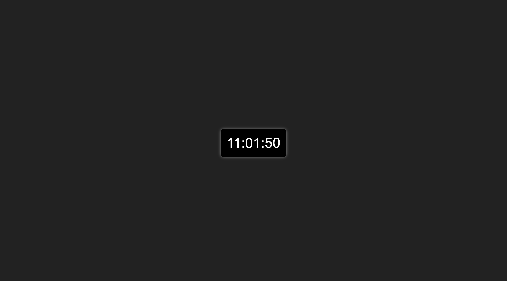

# Digital Clock

This is a simple digital clock built using **HTML, CSS, and JavaScript**. It dynamically updates every second to display the current time in **HH:MM:SS** format.

## Features

- Displays the current time with **hours, minutes, and seconds**.
- Automatically updates every second.
- Responsive and styled with a dark theme.
<!-- @import "[TOC]" {cmd="toc" depthFrom=1 depthTo=6 orderedList=false} -->

- Uses **vanilla JavaScript** for real-time updates.

## How to Use

1. Open the `index.html` file in any modern web browser.
2. The clock will automatically display the correct time.

## Preview

 *(Optional: Add an actual screenshot here)*

## License

This project is open-source and free to use under the MIT License.